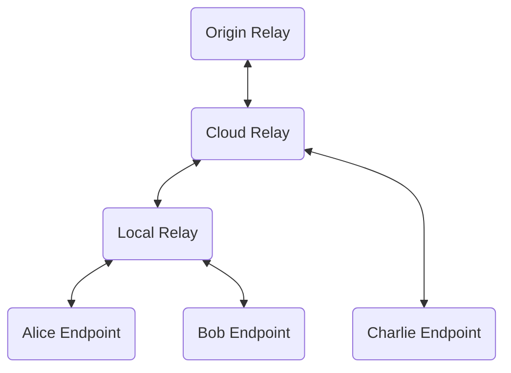
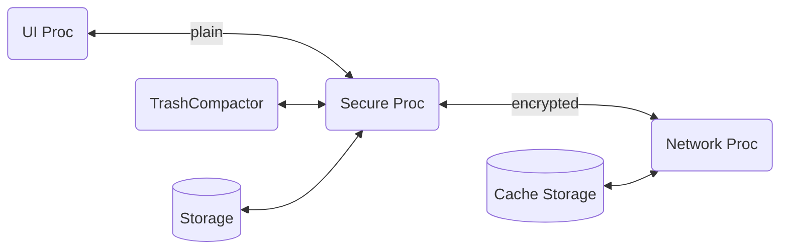

# Architecture

Thy system consists of endpoints that users can use to send and receive
messages and a tree of relays that help distribute and cache the messages.

## Network Architecture

Endpoints can talk to an local relay or cloud relay.

The endpoints ask for given set of messages and receive those messages
from the relay and any future messages that match the request.

The relays form a tree rooted at a single logical Origin
Relay. internally the Origin Relay could be a distributed across many
servers.  Cloud relays are discovered by configuration and DNS
names. Local Relays are discovered by MDNS.

## Terminology, Names, and Concepts

Users send and receive Messages.

Each User belongs to exactly one Organization. Each user has one or more
Devices to send and receive Messages.

Organization have many Teams. Each Team is owned by one Organization but
has a bunch of Users from one or more Organizations. Each team has
multiple Channels and each Channel has a set of Threads and each Thread
has a set of Messages.

## Endpoint Architecture

The UI Process takes care of all the UI. Mostly display of message and
creating new messages. It passes unencrypted messages to the Secure
Processor and receives unencrypted messages. The code is security
reviewed.

The Secure process takes care of management of all keys as well as
encrypting and decrypting all messages. The code is developed securely
and is in Rust.

The Network Process only hands encrypted messages and is not developed
security. It takes care of distribution of the messages over the network
and local caching of messages.

## APIIs

All the API can be serialized across a bi directional serial link.

### UI API

lock, unlock(pin),
sendMsg(), getMsg(msgName),
notifyFilter( name), async notify->newMsg(msgName)
setConfig(key,value), getConfig( key )
log(leve,msg), metric(metric,value)

### NET API

pub( name, data), sub( name )
log(level,msg), metrics(metric,value)

### STORE API

write( blockNum, dataBlock ), read(blockNum)

### Compress API

CompressText, DecompressText

## Tools

### Dump Tool

Takes subpath and dumps all messages and MLS message (commit, welcome,
and key-package)  under that path to individual files

### Load Tool

Takes set of files from dump tools and publishes all the files

### Member Tool

CLI tool that run on osx that allows creation of orgs, teams, users,
devices

* provisioned with orgID and has pub/priv keys for admin user

* Keep track of current number of teams and epoch number 

* Can create a new team and add Admin user to team

* can get hKP as input and add that user to a team

* can dump all deviceID for all devices in a team

* can create and publish vcard for device in team 

## Random Projects

Relay to Relay sync of data using rsync

Relay to Relay sync of data using IPFS.

