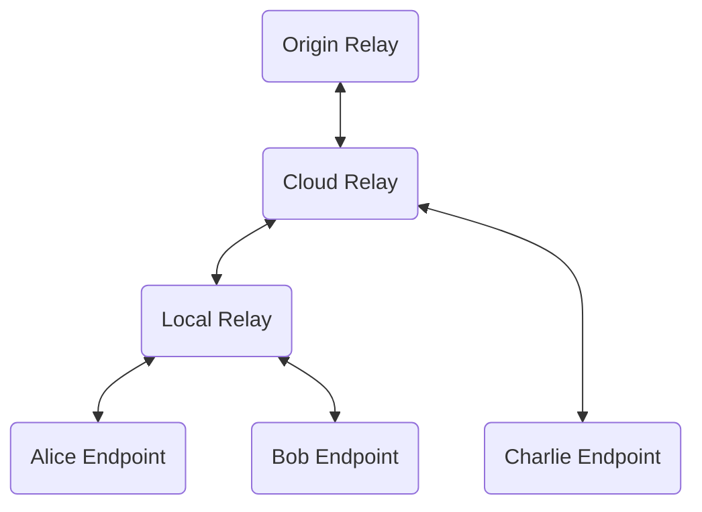
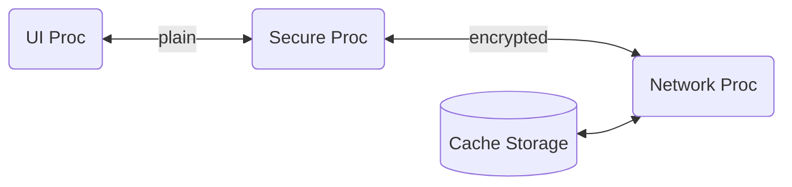

# Architecture

Thy system consists of endpoints that users can use to send and receive
messages and a tree of relays that help distribute and cache the
messages.

Messages users sends are logically formed into a name hierarchy of:

* team/channel/sending-device-identifier/message-number

The user interface orders the messages chronologically when displaying
them. This allows all messages to never change once written and
eliminates the need for a database to synchronize any of the data while
still being able to guarantee conflict free merges after a network
partition. This allows a local set devices to keep communicating even if
they do not have connectivity to the cloud.

Messages are named data objects from named data networking point of
view. This makes it much easier to cheaply add scale and
reliability. Thought this is not strictly needed for a text messaging
application, what we learn here will help see how this can work for voice
and video messages where cost of scaling is much more of an issue.  The
names of the messages are compressed to 128 bit integer to greatly
accelerate search and matching in the pub/sub network described next.

This work is also an experiment to try out a pub/sub mechanism for
building applications. There is a set of relays that cache the named
data objects and are arranged in a tree with clients as leaf nodes in the
tree. Each client can publish named objects, which are stored by the
relays. The clients can also range of the names and received any
existing or new objects that have a name in that range. (It's more of a
netmask than a range but this was easier to explain). 

The messaging application is partitioned into multiple parts to help
minimize the amount of code that needs to be developed securely.

## Network Architecture

Endpoints can talk to a local relay or cloud relay.

The endpoints ask for given set of messages and receive those messages
from the relay and any future messages that match the request.

The relays form a tree rooted at a single logical Origin
Relay. internally the Origin Relay could be a distributed across many
servers.  Cloud relays are discovered by configuration. DNS
names, and/or anycast. Local Relays are discovered by MDNS.

## Terminology, Names, and Concepts

Users send and receive Messages.

Each User belongs to exactly one Organization. Each user has one or more
Devices to send and receive Messages.

Organization have many Teams. Each Team is owned by one Organization but
has a bunch of Users from one or more Organizations. Each team has
multiple Channels and each Channel has a set of Threads and each Thread
has a set of Messages.

## Endpoint Architecture

The UI Process takes care of all the UI. Mostly display of message and
creating new messages. It passes unencrypted messages to the Secure
Processor and receives unencrypted messages. The code is security
reviewed. It is in C++. 

The Secure process takes care of management of all keys as well as
encrypting and decrypting all messages. The code is developed securely
and is in Rust. It also keeps track of all the teams a
device is a member of.

The Network Process only hands encrypted messages and is not developed
security. It takes care of distribution of the messages over the network
and local caching of messages. It is in C++.  It implements the protocol
found in the the [TODO link protocol.md doc]. The low level portion of
the network process simply needs to be able to connect to a relay, and
send publish and subscribes to it.  This process also needs to be able
to find the time - for the initial implementation just the OS time can be
used but later implementations could subscribe to get the time. 

## Relays

Relays cache and distribute names chunks of data. Each chunk has a 128
bit name, an expiry time, and 1K or less of data. Clients that connect
to a relay can subscribe to a set of names they wish to receive data
for.  Clients can publish a chunk to a relay and the network of relays
will ensure that any relay that has a client subscribe to that name will
eventually receive that chunk.

The current implementation arranges all the relays into a tree and when any
relay receives new data data, it distributes it to all sub trees as well
as the node above it. It does not send it to the node it came from. Each
relay is configured with the node above it in the tree and the root node
can be found via DNS at the origin for the message name. 

## Tools

### Dump Tool

Takes subpath and dumps all messages and MLS message (commit, welcome,
and key-package)  under that path to individual files. The undump takes
that set of files from and publishes all the files.

### Member Tool

CLI tool that run on osx that allows creation of orgs, teams, users,
devices. Will be device 0 in any team. Write name of team to and names
of channels as messages to team or channel when creating a new team or
channel.

* provisioned with orgID and has pub/priv keys for admin user

* Keep track of current number of teams and epoch number 

* Can create a new team and add Admin user to team

* can get hKP as input and add that user to a team

* can dump all deviceID for all devices in a team

