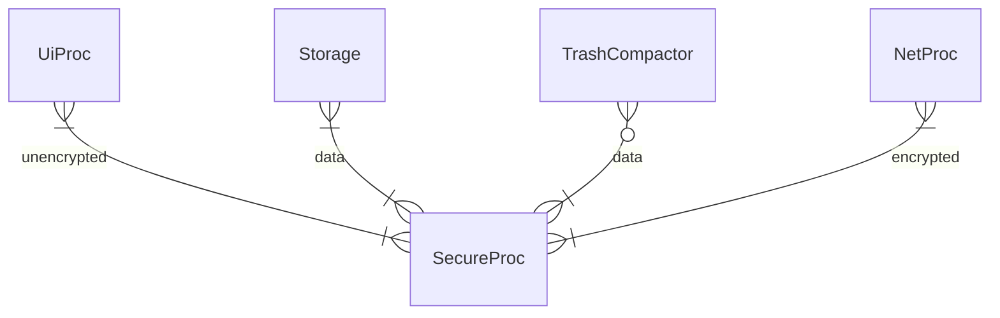
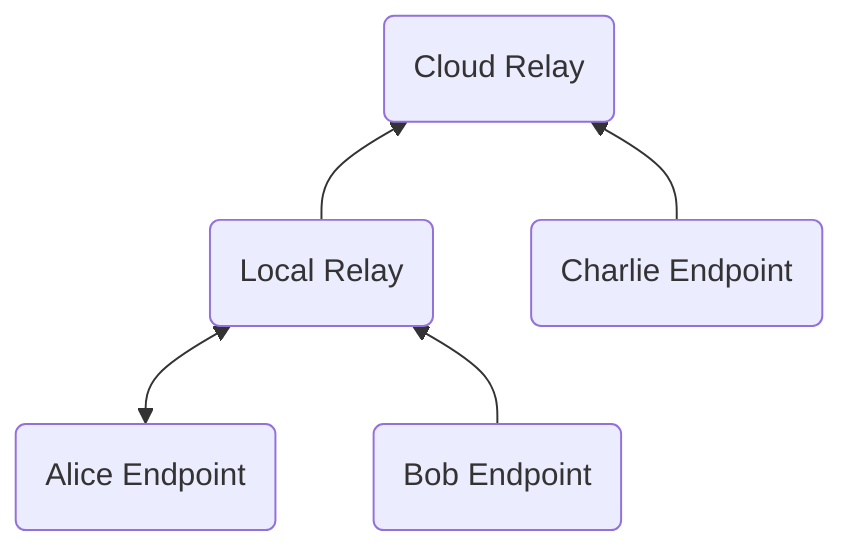

# Architecture 

## Endpoint Architecture 

```mermaid
erDiagram
    UiProc }|--|{ SecureProc : "unencrypted"
    SecureProc
    Storage }|--|{ SecureProc : "data"
    TrashCompactor }o--|{ SecureProc : "data"
    NetProc }|--|{ SecureProc : "encrypted"
```
    
# Network Archtecture

```mermaid
graph BT
    A(Alice Endpoint) <--> LR(Local Relay) 
    B(Bob Endpoint) --> LR
    LR --> CR(Cloud Relay)
    C(Charlie Endpoint) --> CR
```

