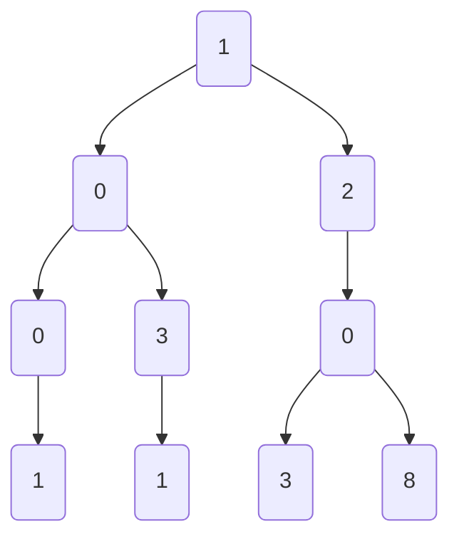
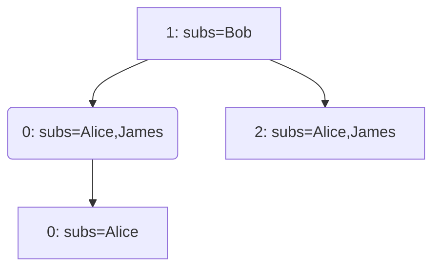

# Project Notes

This is an unstructured and informal notes document on thoughts/updates.


## Shortname (SN)

Shortname (SN) is fixed at 128bits in length, utilizing a structure that supports bit masking by length, similar to IPv6 addressing.

SN has common parts, such as:

```c
  uint32_t         origin_id: 24;          ///< Origin ID
  u_char           app_id;                 ///< App ID
  u_char           path;                   ///< Path as defined by enum NamePath 
```

The above defines **40 bits** as common in every SN. The remaining **88 bits** are application/user defined.  The encoding/decoding of the remaining **88 bits** are application specific.

### Publish Message Efficiency

A published message needs to be forwarded to relays and subscribers. Currently, relays are defined in a single list at startup (e.g., configuration), which may or may not be scoped/filtered based on SN in the future.

Subscribers are dynamic and impose performance inefficiency in terms of looking up the subscribers remote addresses.  Currently, the method to lookup subscribers is to iterate over all mask/length combinations for the given SN. This does not scale for hundreds of thousands/millions of messages per second. 

In effort to remove the bit level iteration loop, a SN trie can be utilized. 

### Subscriber Tracking and Maintenance

Subscribers may use one or more UDP/QUIC flow (tuple) connections (e.g., source IP N and source port A, B, and C). Subscribers bind to a specific **flow ID**.  This allows subscribers to scale at the connection/flow level based on each subscription.  Subscriptions can be more specific, such as subscribing via connection A to X/64, via connection B to Y/120, and via connection C to Z/120. 

Subscribers (aka endpoints) may move between networks.  For example, switching from WiFi to Cellular.  When moving between networks, the endpoint subscriber performs pings on regular intervals.  These pings keep the subscriptions alive and healthy. The relay network will detect if the ping is from a different UDP/QUIC flow tuple. If so, it will update accordingly. In this sense, the IP and port are ephemeral to the subscription flow being tracked internally in memory. 

#### In Memory Tracking of Subscribers

Endpoints (subscribers) are identified by a **device id**. The endpoint object contains:

1. A list of connection flows IDs
2. A map of active subscription IDs

```subscription_map```: Every subscription is stored in an O(1) **map** with a key that identifies the subscription and associated connection ID. The key is returned via a subscribe ACK to the endpoint. The endpoint uses the key/id in subsequent messages, such as pings. This allows for the client to support IP/network mobility. The key is added to the endpoint list of active subscriptions.

```connection_map```: Connection flows are stored in an O(1) **map** with a key that identifies each connection.  Each connection has a distinct reference count that indicates the number of subscriptions associated.

The subscription will expire and be removed based on the below conditions:

1. The endpoint sends an **unsubscribe** to immediate unsubscribe
2. The endpoint fails to send periodic ping messages that includes the subscription ID

When a subscription is removed:

1. The endpoint subscription map is updated to remove the id
2. The connection reference count of subscriptions is decremented. If the reference count is zero, the connection is removed from the endpoint connection list and from the ```connection_map```.  
3. The ```subscription_trie``` is updated to remove the connection entry

> **Note** **Question** : Can we have multiple endpoints behind the same source IP and PORT (multiplexed)?

A ```ping``` or ```subscribe``` can change the connection for a subscription. The relay will automatically update the endpoint object and connection map. When the ping subscription ID indicates a different connection ID (source IP/port), below is processed:

1. Create a new connection map entry. If the map entry exists, update the reference count. 
2. Decrement the previous connection map entry reference count. If zero, remove it. 
3. Remove old endpoint connection list ID and add new/updated one

### Subscriber Trie

The subscriber prefix trie is super light weight and contains only a list of ```sendto addr``` entries.  This allows the publishing of messages to be very fast
without having to perform additional lookups.

Subscription and subscriber tracking maintains the trie. When a subscription is removed, the ```sendto addr``` entry is removed. When a subscription is added, a ```sendto addr``` is added.  

A trie path may introduce duplication. The relay forwarding process will use a list of ```sendto``` entries to track who has already been sent the message.

#### Example

**Published Messages:**

* a. 1001
* b. 1203
* c. 1031
* d. 1208

***Subscriber/cache prefix trie example***



**Subscribers:**
* Alice
  * 10xx
  * 12xx
  * 100x -- This is an example of needing to dedup subscriptions, but still maintain them considering the unsubscribe could be for the more or less specific
* Bob
  * 1xxx

* James
  * 10xx
  * 12xx

***Example showing just subscribers, trimmed version of the previous trie***



As shown above, each published message would send to subscribers within the complete path.  This can include duplicate subscriptions. Only one copy of the message is sent to a given subscriber, even if they appear multiple times in the path.  For example, Alice is shown twice for published message **1001**. 

A trimmed path based on subscriptions is more efficient than storing a complete path of 128 bits for every short message. The trie grows based on subscriptions. Each node in the trie may have zero or more remotes/subscribers.  The node list is a unique set. 

Adding nodes is very fast and efficient.  Removing/cleaning up nodes in a trie is a bit more costly.  In order to avoid having to walk and remove a remote from each path node within the trie, another list is maintained of remotes and points to nodes lists (unique sets) they are associated to. 


## Thoughts

* Endpoint subscription must expire at some point.  
* Endpoint subscription must be access controlled/authorized and should limit auto subscriptions to
  sub-channels/streams.
* Caches should cache for a short period of time, enough to retransmit and handle
  disconnect/reconnects, but short enough to drop messages that are considered too old.
  Cache age is best to be at the stream/channel/topic level
* Endpoints start up cycle connects first to the local relay to advertise it self and to subscribe
  to streams.
* Each endpoint subscribes and produces to a series of streams for control signaling
  * Endpoints are advertise to other endpoints via one or more group registration streams. Multiple
    streams are used to support the use-case of limiting what some endpoints can see. For example,
    org level stream.
  * Endpoints subscribe to relay network notifications.  This includes details about the Local Relay
    the endpoint and other profile level settings for endpoints that use the local relay. For
    example, max allowed age of messages, rate limits, ...
  * Endpoints produce/advertise themselves to the registration streams that they are instructed to
    via the notification stream
  * Endpoints produce/advertise notifications to the relay network. For example, instruct the relay
    network to handle its messages a specific way, add streams, etc.
* Use groups for 1:1 instead of direct addressing so that anyone else
  can join in
* Endpoint registration includes the ER it's attached. This directly drives how other ERs can optimize paths. 

* protocol specific; a stream is within a message channel (e.g., topic).  Multiple streams can exist, but they may be forwarded via the same channel.  When they are forwarded via the same channel, the endpoint and relays demux to specific endpoints
* A channel defines cache retention, optimized forwarding paths, general authorization, ...
