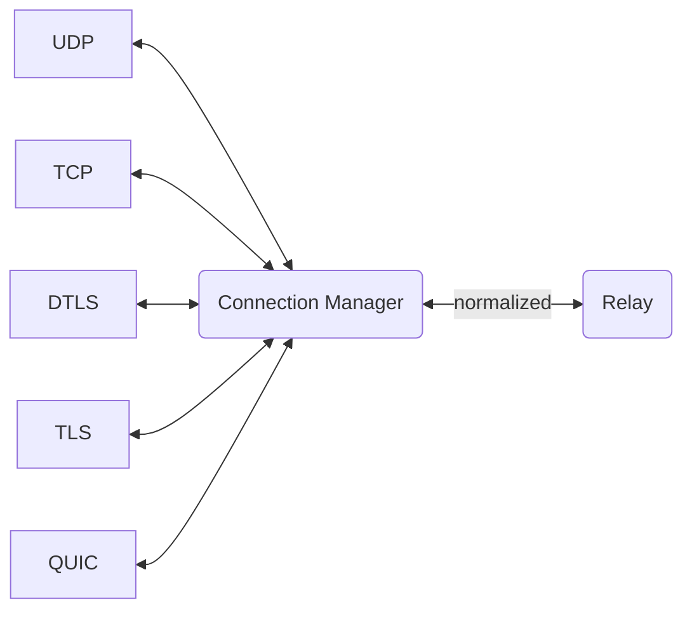
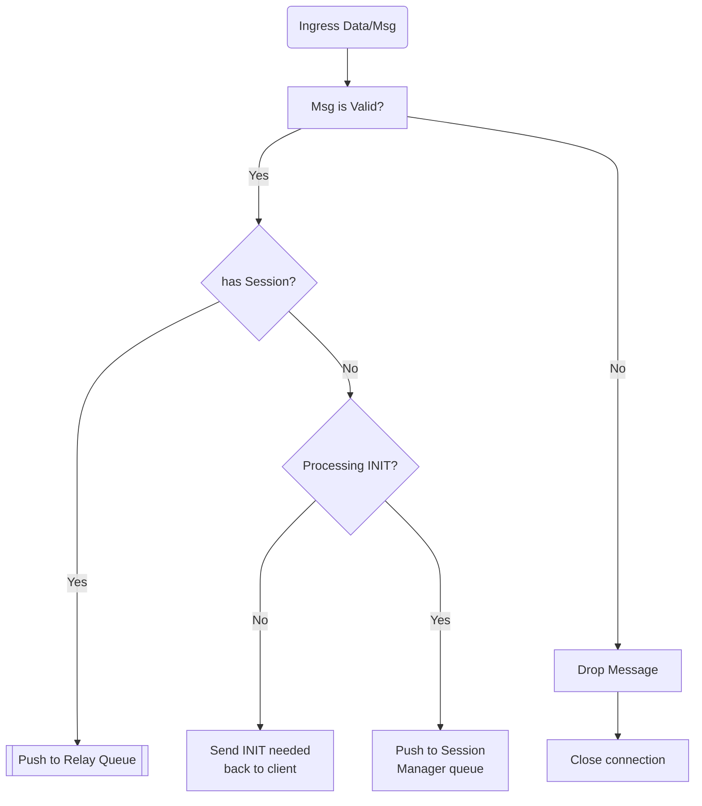
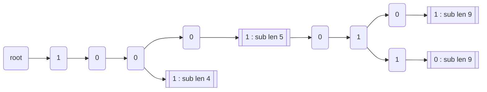
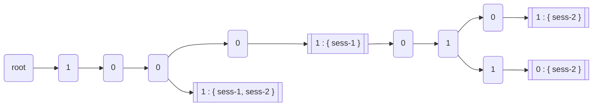

# Project Notes

This is an unstructured and informal notes document on thoughts/updates.


## Shortname (SN)

Shortname (SN) is fixed at 128bits in length, utilizing a structure that supports bit masking by name_length, similar to IPv6 addressing.

SN is application specific from the relay perspective. The two requirements for applications are:

1. Support length based wildcards, similar to IPv4/IPv6 prefix lengths. Wildcard isn't a star anywhere.
   The length defines how many bits are significant in the shortname. The remaining bits are wild. 
2. De-duplication on message forwarding is performed at the SN level. Each message **MUST** be
   unique within a time period, otherwise it will be considered duplicate and suppressed.
   Normally the last 16 or more bits are used for message/sequence Ids. It is suggested to use
   at least 20 bits for message/sequence numbers.

## Endpoint Connections

Connections are:
* bidirectional streams
* may use different transports, such as UDP, TCP, TLS, DTLS, QUIC, etc.
* normalized to a consistent stream(s) to relay
* mapped to a session ID



In a lossy network, in the case of changing networks, or a simple NAT/PAT/SNAT clearing can cause connections
to be ephemeral. Mapping the connection to a session ID enables transition to new connections without having to
change existing subscriptions. The session ID provides the relay a consistent data stream that is agnostic
to the connection transport protocol. The relay sends produced messages to subscriptions that are mapped to
session IDs. The connection manager writes/sends to the endpoint/client based on the current authenticated connection. 

The connection transport protocol forms a bidirectional data stream for reading and writing.
The connection establishment is handled by the transport protocol, such as TLS, QUIC, ... Once the connection has
a bidirectional data stream, messages can be exchanged with the relay.

The protocol specific connection manager can implement rate limits or other DoS preventive methods. The transport
may implement basic connection level authentication, such as MTLS, but this does not replace the relay authentication
on sessions via INIT. An established session does not have to re-authenticate when connections change. 

The relay does not directly interact with connections. Instead, it interacts with sessions to which have a connection
endpoint. A session only has one connection endpoint at any given time.


### Connection Manager Packet Processing Flow



```c++
// Msg defined already in slowr

struct SessionMsg {
    uint32_t      conn_id;          // Local connMgr specific indexed number for connection
    string        session_id;       // Maybe empty if unknown/new
    Msg           msg;
};

class ConnectionManagerInterface {
    public:
      virtual ~ConnectionManagerInterface() { };
      
      virtual void run () = 0;
      virtual void stop () = 0;
      
      virtual void add_session(uint32_t conn_id, std::string sess_id) = 0;
      virtual void update_session(uint32_t conn_id, std::string sess_id) = 0;
      virtual void term_session(std::string sess_id) = 0;
      virtual void term_connection(uint32_t conn_id) = 0;
      virtual void write_message(std::string sess_id, void *data) = 0;
    
    protected:
      atomic_or_concurrent_queue<Msg>         relay_write_queue;
      atomic_or_concurrent_queue<SessionMsg>  sess_mgr_write_queue;
};
```

## Session Manager
Session manager handles new sessions and subscription changes.  Subscriptions can take milliseconds
to process. Handling subscriptions asynchronously from the forwarding process reduces relay latency.  

Session manager performs the following:

1. Monitors each connection manager ```sess_mgr_write_queue``` for incoming messages. 
2. Maintains a ```session_map``` of all sessions. The key is the session ID and the value is a ```session_object```.
3. Adds or removes sessions from the ```session_map``` on change
4. Informs the connection manager of a new or removed session
5. Maintains a subscription tree per session. This tree includes all subscribed SNs. 
6. Maintains the ```relay_subscription_tree``` of all active subscriptions with session IDs that should receive
   data/messages. 

### Session Object
The relay maintains a map of session objects, keyed by the session ID. 

```c++
struct session_object {
    ConnectionManagerInterface &cm;
    SNTree                     subscriptions;
};
```

## Subscriptions
Clients subscribe to SNs using a mask bit name_length. This is similar to IP network prefix/len notation. A client that
subscribes to a shorter bit name_length SN will receive all messages equal to or longer than the bit name_length specified. A
client may subscribe to more specifics, which will be ignored in favor of the less specific.  For example, subscribe
to SN/80, SN/90, and SN/91.  The 90 and 91 are redundant to SN/80.  As long as the subscription for SN/80 exists,
SN/90 and SN/91 are suppressed to avoid duplicate messages being sent to the subscriber. When/if the subscriber
unsubscribes the less specific SN/80, the more specifics will be added and used. 

In effort to reduce and remove duplication, the subscription process is a little more involved to ensure only
the least specific subscription is used by the relay when forwarding messages.

### Subscriber Tree

There are two subscriber prefix trees, both of which use the same prefix tree implementation.

#### 1) Per Session Subscriber Tree
Every session has a prefix tree of all SNs subscribed. The node value is a boolean that indicates
subscription point for the given SN. The node point of subscription is based on the mask name_length. 

When adding a new subscription, the ```add()``` method will return the first found node name_length in the path that aggregates
the newly added subscription. For example, when adding SN/90, there might be SN/42 that aggregates SN/90.  The return
will indicate 42.  This informs the caller that there is an existing subscription already that covers the newly added
more specific. If there isn't a value returned, then the SN needs to be added to the ```relay_subscription_tree```.

When removing a subscription, the ```remove()``` method will search the session subscription tree for a match. If there
is a node found that aggregates the removed subscription, the more specific will be removed only. If there isn't an
aggregate node found, the subscription will be removed as follows:

1. If session flag indicates duplicates are **NOT** allowed on unsubscribe, then the subscription will be removed from
   both the relay and per session subscription tree. 
2. The session subscription tree will be walked from the point of removal to find the next set of subscriptions that
   should be added to the relay subscription tree.  For example, if SN/42 is removed, SN/90 would need to be added. 
3. If the session flag indicated duplicates are allowed on unsubscribe, then the subscription will be removed from the
   relay tree after the other more specifics are added. 

**Subscription tree example, values are bits:**

* 10001/5
* 10001 01 01/9
* 10001 01 10/9
* 1001/4




The above diagram illustrates the subscriptions in a prefix tree. The node with ``` b : sub``` indicates that this is
the point that has been subscribed. 


#### 2) Relay Subscriber Tree

The relay subscription tree contains only aggregate subscriptions.  The value of the node is a vector/array of session
ids that have subscribed.  When there are no session IDs left, the array is freed and removed. This tree is maintained
by the session manager based on subscriptions being added and removed. 

> **Note**
> : Lock free methods are used to maintain the prefix tree and session array 

Example of the relay subscription tree.


* **session-1**
  * 10001/5
  * 10001 01 01/9
  * 10001 01 10/9
  * 1001/4

* **session-2**
  * 10001 01 01/9
  * 10001 01 10/9
  * 1001/4




The above illustrates two sessions with various subscriptions. Notice that **sess-1** has been de-duplicated (aggregated)
at ```10001/5```.  Only **sess-2** is added to the more specifics because **sess-2** did not subscribe to an aggregate.


## Relay Forwarding

Produced messages are received by the Connection Manager and then pushed to ```relay_write_queue```.  The relay
monitors this queue and processes messages in FIFO order. Processed messages are forwarded to all sessions that
have subscribed to the produced SN.  The relay lookups the produced SN in ```relay_subscription_tree```. Each node
that has a session list of session ids along the SN path will form the list of sessions (subscribers) that will
receive a copy of the message. The relay uses the CM ```write_message()``` method to write messages to each session.
The connection manager may buffer/transmit so that the relay is not delayed. 

