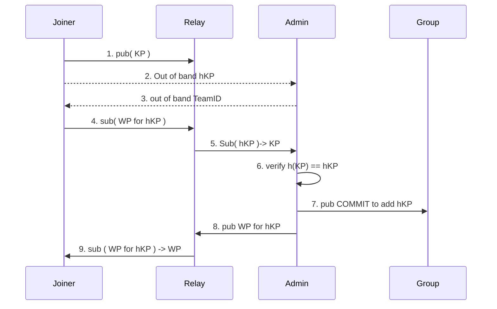

# QMessage Protocol

Each message gets a unique name and is published at that name. Clients
subscribe to a wild carded subset of the name to receive the desired
messages.

Users can have multipel devices each with their own MLS KeyPackage.

Devices are added to a team and can access any channel in that team.

Devices get a welcome message for any team they can join.

## Msg Names

Names follow the form:

```
qmsg://<orgin-domain>/<version>/msg/<org>/<team>/<channel>/<device>/<msgNum>
```

* origin domain: DNS domain name of origin server
* version: protocol version number 
* org: number allocated by the origin domain for each organization using
  this origin
* team: number allocated by org for each team in the org 
* channel: number allocated by team owner for each channel in the team
* device: number unique to the team for each device in the team
* msgNum: number allocated by the device for each message in this
  channel from this device

In any team, channel 1 is reserved for announcing channels and
management of the team. All Devices in the team are members of this
channel. 

In any org, team 1 is reserved to manage devices in org and all devices
are in this team. 

### Short Msg Names

* originID: 48 bits.  SHA1 hash of origin-domain
* appID: 48 bits. low 2 bits of version, 3 bits=001, 11 bit org, 16 bit
  team, 16 bit channel
* groupIID: 16 bits. device 
* objIID: 16 bits. msgNum.

msg ID is 128 bit number formed by concatenating originID, appID,
groupID, objID

channel ID is 96 bit number formed by  concatenating originID, appID

Devices publish messages to a short msgID and receive messages by
subscribing to a channelID. 

## Messages

Each message has a:
* expiry time 
* MLS encrypted payload 

## Payload

Each payload has:
* mime message type
* message data
* creation time
* optional reply to device/msg
* optional replaces device/msg
* optional bool updates channel display name 
* optional bool updates team display name 

To create a threat, the reply to is set to identify the first message of
the thread. Threads can not be nested.

To edit a message, a new message is sent with a replaces that identifies
the message being edited.

## mine types

### text/ascii-printable

Allows ASCII characters 0x20 to 0x7E. Note this does not include CR or
LF so messages meant to display on different lines need to be sent as
multiple messages.


## MLS

The basic flow to add a new user involves geting the key package (KP) to
an admin of the group, having the admin get a welcome package (WP) to the
joner that gives them the MLS info they need then the Admin sending a
COMMIT to all the existing members of the team so they know that the
joiner is added.

The Joiner and Admin are both configured with OrgID. 

To simplify the first version, each org has a single Admin that is a
member of every team in the Org. This remove the need for a global lock
and we can remove this constraint later. 

This first version does not have any identity system so the joiner and
the admin need to pass some information out of band to validate the
trust to add a device to the team. The joiner tells the the Admin the
fingerprint of the KP which is called hKP. The Admin tells the joiner
the number of the team they will be added too.

The hKP is fairly long to provide out of band. A future version will
instead exchange a short password (pw) and device identifier out of band
then use this password in a PAKE to exchange the hKP. The device
i9dentier can be a short version of the hKP.



Once the Joiner receives a WP, it will extract the LeafIndex from the
MLS message and use that as the DeviceID in this team.

This requires several new endpoints to publish and subscribe to KP,
Welcome, and commit messages. 


### KP Names
```
qmsg://<orgin-domain>/<version>/key-package/<org>/<hKP-high48>/<hKP-low16>
```

short KP Name is:
* 48 bit hash origin,
* low 2 bits of version, 3 bits=2, 11 bit org,
* high 48 bits of hKP,  low 16 bits of hKP
 


### Welcome Names
```
qmsg://<orgin-domain>/<version>/welcome/<org>/<team>/<hKP-high48>/<hKP-low16>
```


short KP Name is:
* 48 bit hash origin,
* low 2 bits of version, 3 bits=3, 11 bit org, 16 bit team,
* high 32 bits of hKP,  low 16 bits of hKP
 


### Commit Names

```
qmsg://<orgin-domain>/<version>/commit/<org>/<team>/0/<epoch>
```


short KP Name is:
* 48 bit hash origin,
* low 2 bits of version, 3 bits=4, 11 bit org, 16 bit team,
* 32 bits of zero,   low 16 bits of epoch 
 


