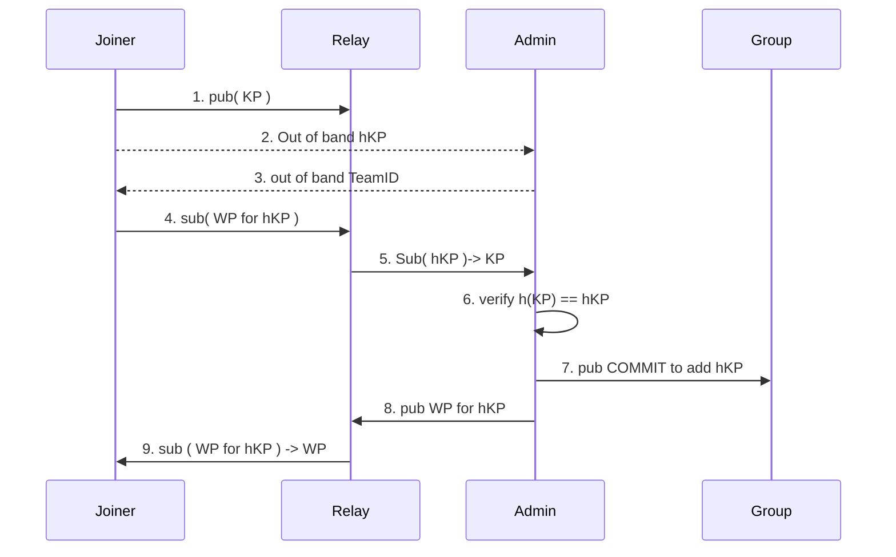

# QMessage Protocol

Each message gets a unique name and is published at that name. Clients
subscribe to a wild carded subset of the name to receive the desired
messages.

Users can have multiple devices each with their own MLS KeyPackage.

Devices are added to a team and can access any channel in that team.

Devices get a welcome message for any team they can join.

## Msg Names

Names follow the form:

```
qmsg://msg/org-<org>/team-<team>/ch-<channel>/dev-<device>/<msgNum>
```

* origin domain: DNS domain name of origin server
* version: protocol version number 
* org: number allocated by the origin domain for each organization using
  this origin
* team: number allocated by org for each team in the org 
* channel: number allocated by team owner for each channel in the team
* device: number unique to the team for each device in the team
* msgNum: number allocated by the device for each message in this
  channel from this device

In any team, channel 1 is reserved for announcing channels and
management of the team. All Devices in the team are members of this
channel. 

In any org, team 1 is reserved to manage devices in org and all devices
are in this team. 

### Short Msg Names

* originID: 24 bits =TBD .  ITAD for use by this origin 
* appID: 8 bits =1
* path: 8 bits = ( 1 for pub, ...)
* org 18 bits 
* team 20 bits 
* channel 10 bits
* device 20  bits
* msg 20 bits 

msg ID is 128 bit number formed by concatenating abote

channel ID is  formed by  concatenating above with device set to 0 
and msg set to 0

Devices publish messages to  msgID and receive messages by
subscribing to a channelID with 40 bit wildcard (for device and message)

## Messages

Each messages has an envelope data taht is authenticated but not
encrypeted followed by and encryped payload. 

### Envelope Data 

* expiry time (32 bit in ms since unix epoch)
* short name (128bit)
* epoch used for encryption (low 16 bits of epoch)

## Encryped Payload Data

* creation time (64 bit ms)
* msg data len = 16 bits 
* message data 
* option flags 16 bit 
* optional reply to device/msg 
* optional replaces device/msg 
* optional bool updates channel display name (8 bit with other) 
* optional bool updates team display name 

To create a threat, the reply to is set to identify the first message of
the thread. Threads can not be nested.

To edit a message, a new message is sent with a replaces that identifies
the message being edited.


## MLS

The basic flow to add a new user involves getting the key package (KP) to
an admin of the group, having the admin get a welcome package (WP) to the
joiner that gives them the MLS info they need then the Admin sending a
COMMIT to all the existing members of the team so they know that the
joiner is added.

The Joiner and Admin are both configured with OrgID. 

To simplify the first version, each org has a single Admin that is a
member of every team in the Org. This remove the need for a global lock
and we can remove this constraint later. 

This first version does not have any identity system so the joiner and
the admin need to pass some information out of band to validate the
trust to add a device to the team. The joiner tells the the Admin the
fingerprint of the KP which is called hKP. The Admin tells the joiner
the number of the team they will be added too.

The hKP is fairly long to provide out of band. A future version will
instead exchange a short password (pw) and device identifier out of band
then use this password in a PAKE to exchange the hKP. The device
identifier can be a short version of the hKP.



Once the Joiner receives a WP, it will extract the LeafIndex from the
MLS message and use that as the DeviceID in this team.

This requires several new endpoints to publish and subscribe to KP,
Welcome, and commit messages. 


### Key Package Names
```
qmsg://key-package/org-<org>/team-<team>/kp-<hKP>
```

* originID: 24 bits =TBD .  ITAD for use by this origin 
* appID: 8 bits =1
* path: 8 bits = ( 2 for key-package, ...)
* org 18 bits 
* team 20 bits 
* zero pad 2 bits
* fingerprint 48 bit hash of public signing key


### Welcome Names
```
qmsg://welcome/org-<org>/team-<team>/kp-<hKP>
```

short KP Name is:
* originID: 24 bits =TBD .  ITAD for use by this origin 
* appID: 8 bits =1
* path: 8 bits = ( 3 ...)
* org 18 bits 
* team 20 bits 
* zero pad 2 bit
* fingerprint 48 bit hash of public sign key 

data of welcome should have the deviceID to use in the team 

 
### Commit All Names

The team gets a single comit with all the info for all the devices

```
qmsg://commit-all/org-<org>/team-<team>/epoch-<epoch>/rand-<rand>
```

short KP Name is:

* originID: 24 bits =TBD .  ITAD for use by this origin 
* appID: 8 bits =1
* path: 8 bits = ( 4 ...)
* org 18 bits 
* team 20 bits 
* epoch - 24 bits
* rand - 26 bit 

Can adding a random 26 bit at end allow detection of two differnt
devices doing commit at same time ????


### Commit One Names

Each device gets a commit with just the info for that device 

```
qmsg://commit-one/org-<org>/team-<team>/dev-<device>/epoch-<epoch>/rand-<rand>
```

short KP Name is:

* originID: 24 bits =TBD .  ITAD for use by this origin 
* appID: 8 bits =1
* path: 8 bits = ( 5 )
* org 18 bits 
* team 20 bits 
* device 20  bits 
* epoch  24 bits
* rand 6  - random number 


## Billing

The originID + appID for the biling identifier. For each billing
identifier, the  relays keep track of bytes reeceived, bytes transmited,
and messages stored in bytes times number of seconds. 

Auth works by app sending relay a request to publish to a certain range
and relays sending up to orgin relay which returns a yes/no permision. 

